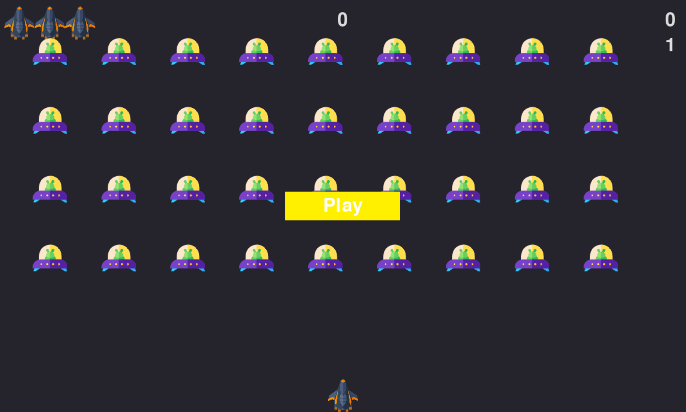
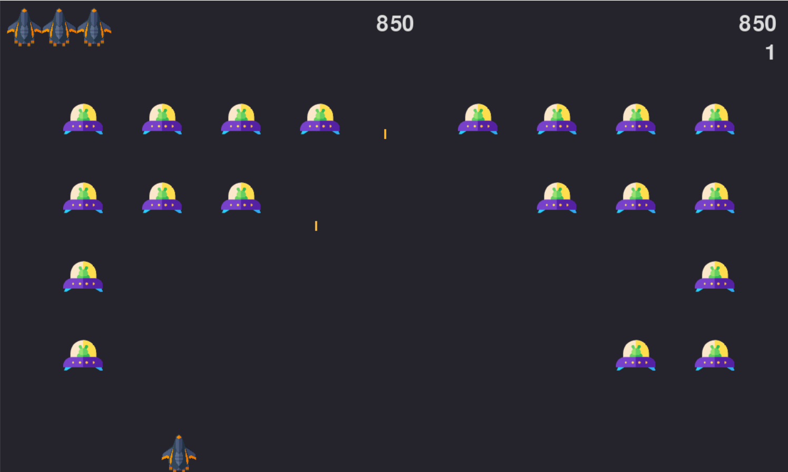
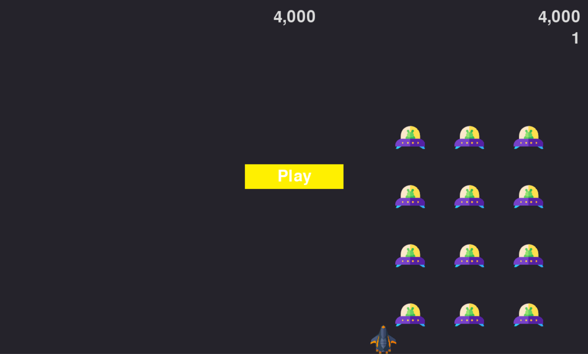

# Alien-Invaison

This is a game project from book **Python Crash Course**, named **Alien Invasion**.

## Setup

### Open up terminal

- **Clone & Open Directory**

```Shell
git clone https://github.com/altunog/Alien-Invaison.git alien_invasion && cd alien_invasion
```

- **Install Requirements**

```Shell
pip install -r requirements.txt
```

- **Run**

```Bash
python alien_invasion.py
```

## Screenshots

> Start Screen



> Gameplay



> Ending & Restart


